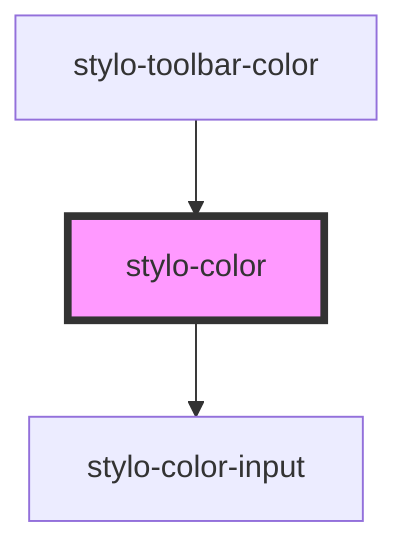

# stylo-color

The "Color Picker" component is a simple component to, guess what, pick colors 😉.

## Usage

The "Color Picker" Web Component could be integrated using the tag `<stylo-color/>`.

```
<stylo-color>
  <span slot="more">...</span>
</stylo-color>
```

#### Palette

The `palette` attribute is a complex object and therefore could only be set using Javascript.

It is defined as the following:

```
export interface StyloPaletteColor {
    hex: string;
    rgb?: string;
}
export interface StyloPalette {
  color: StyloPaletteColor;
  alt?: string;
}
```

The key value is the color provided as `hex` value. The `rgb` value is use for presentation purpose, for the hover action and the highlight of the selected color. If you wish to highlight a selected color, you could either provide `color-hex` or `color-rgb`.

The default palette is the following:

```
export const DEFAULT_PALETTE: StyloPalette[] = [
    {
      color: {
        hex: '#8ED1FC',
        rgb: '142,209,252',
      },
      alt: 'Light blue',
    },
    {
      color: {
        hex: '#0693E3',
        rgb: '6,147,227',
      },
      alt: 'Blue',
    },
    {
      color: {
        hex: '#7BDCB5',
        rgb: '123,220,181',
      },
      alt: 'Light green',
    },
    {
      color: {
        hex: '#00D084',
        rgb: '0,208,132',
      },
      alt: 'Green',
    },
    {
      color: {
        hex: '#FCB900',
        rgb: '252,185,0',
      },
      alt: 'Yellow',
    },
    {
      color: {
        hex: '#FF6900',
        rgb: '255,105,0',
      },
      alt: 'Orange',
    },
    {
      color: {
        hex: '#F78DA7',
        rgb: '247,141,167',
      },
      alt: 'Pink',
    },
    {
      color: {
        hex: '#EB144C',
        rgb: '235,20,76',
      },
      alt: 'Red',
    },
    {
      color: {
        hex: '#ffffff',
        rgb: '255,255,255',
      },
      alt: 'White',
      display: {
        borderColor: '#ddd',
        boxShadowColor: '221,221,221',
      },
    },
    {
      color: {
        hex: '#ABB8C3',
        rgb: '171,184,195',
      },
      alt: 'Grey',
    },
    {
      color: {
        hex: '#000000',
        rgb: '0,0,0',
      },
      alt: 'Black',
    },
];
```

<!-- Auto Generated Below -->

## Properties

| Property   | Attribute   | Description                                                                                                      | Type             | Default                 |
| ---------- | ----------- | ---------------------------------------------------------------------------------------------------------------- | ---------------- | ----------------------- |
| `colorHex` | `color-hex` | The current selected color provided as hexadecimal value                                                         | `string`         | `undefined`             |
| `colorRgb` | `color-rgb` | The current selected color provided as a rgb value (without "rgb()", only value such as for example 255, 67, 54) | `string`         | `undefined`             |
| `inputAlt` | `input-alt` | An accessibility label for the color input field                                                                 | `string`         | `'Input a color (hex)'` |
| `palette`  | --          | The palette of color.                                                                                            | `StyloPalette[]` | `DEFAULT_PALETTE`       |

## Events

| Event         | Description             | Type                             |
| ------------- | ----------------------- | -------------------------------- |
| `colorChange` | Emit the selected color | `CustomEvent<StyloPaletteColor>` |

## CSS Custom Properties

| Name                                          | Description                                                            |
| --------------------------------------------- | ---------------------------------------------------------------------- |
| `--stylo-color-button-border-radius`          | Button border-radius @default 2px                                      |
| `--stylo-color-button-height`                 | Button height @default 28px                                            |
| `--stylo-color-button-margin`                 | Button margin @default 4px                                             |
| `--stylo-color-button-outline`                | Button outline @default none                                           |
| `--stylo-color-button-width`                  | Button width @default 28px                                             |
| `--stylo-color-flex-wrap`                     | Component flex-wrap @default wrap                                      |
| `--stylo-color-hash-background`               | Hash (#) background @default rgb(240, 240, 240) none repeat scroll 0 0 |
| `--stylo-color-hash-border-radius`            | Hash (#) border-radius @default 4px 0 0 4px                            |
| `--stylo-color-hash-color`                    | Hash (#) color @default rgb(152, 161, 164)                             |
| `--stylo-color-hash-height`                   | Hash (#) height @default 28px                                          |
| `--stylo-color-hash-width`                    | Hash (#) width @default 28px                                           |
| `--stylo-color-input-background`              | Input background @default inherit                                      |
| `--stylo-color-input-border-radius`           | Input border-radius @default 0 4px 4px 0                               |
| `--stylo-color-input-box-shadow`              | Input box-shadow @default rgb(240, 240, 240) 0 0 0 1px inset           |
| `--stylo-color-input-color`                   | Input color @default rgb(102, 102, 102)                                |
| `--stylo-color-input-container-border`        | The border property of the input and hash container                    |
| `--stylo-color-input-container-border-radius` | The border-radius property of the input and hash container             |
| `--stylo-color-input-font-family`             | Input font-family @default inherit                                     |
| `--stylo-color-input-height`                  | Input height @default 28px                                             |
| `--stylo-color-input-margin`                  | Input field margin @default 4px                                        |
| `--stylo-color-input-max-width`               | Input max-width @default 136px                                         |
| `--stylo-color-input-padding`                 | Input padding @default 0 4px                                           |
| `--stylo-color-overflow`                      | Component overflow @default visible                                    |
| `--stylo-color-padding`                       | Component padding @default 8px                                         |

## Dependencies

### Used by

- [stylo-toolbar-color](../../toolbars/toolbar/actions/color)

### Depends on

- [stylo-color-input](../input)

### Graph



---

_Built with [StencilJS](https://stenciljs.com/)_
