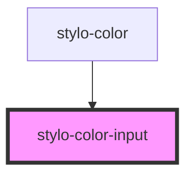

# stylo-color-input

<!-- Auto Generated Below -->

## Properties

| Property         | Attribute          | Description | Type     | Default     |
| ---------------- | ------------------ | ----------- | -------- | ----------- |
| `colorHex`       | `color-hex`        |             | `string` | `undefined` |
| `colorRgb`       | `color-rgb`        |             | `string` | `undefined` |
| `customColorRgb` | `custom-color-rgb` |             | `string` | `undefined` |
| `inputAlt`       | `input-alt`        |             | `string` | `undefined` |

## Events

| Event            | Description | Type                             |
| ---------------- | ----------- | -------------------------------- |
| `selectHexColor` |             | `CustomEvent<StyloPaletteColor>` |

## Dependencies

### Used by

- [stylo-color](../color)

### Graph

---

_Built with [StencilJS](https://stenciljs.com/)_
