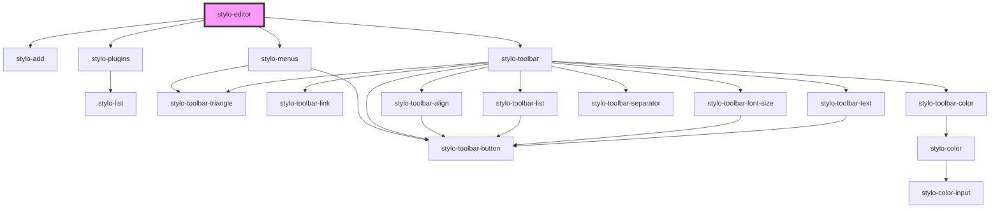

# stylo-editor

<!-- Auto Generated Below -->

## Properties

| Property       | Attribute | Description                                                                                                                                                                                                                                                                                 | Type          | Default     |
| -------------- | --------- | ------------------------------------------------------------------------------------------------------------------------------------------------------------------------------------------------------------------------------------------------------------------------------------------- | ------------- | ----------- |
| `config`       | --        | Optional editor configurations - i18n provides language and optional list of custom translations - plugins, if provided, replaces the default plugin config - Toolbar, if provided, is merged with the default toolbar config - Menus, if provided, is merged with the default menus config | `StyloConfig` | `undefined` |
| `containerRef` | --        | The container (e.g. an article, a div, etc.) that contains the content, the paragraphs. Must have the attribute `contenteditable` set to `true`.                                                                                                                                            | `HTMLElement` | `undefined` |

## Dependencies

### Depends on

- [stylo-add](../plugins/add)
- [stylo-plugins](../plugins/plugins)
- [stylo-menus](../toolbars/menu)
- [stylo-toolbar](../toolbars/toolbar/toolbar)

### Graph

---

_Built with [StencilJS](https://stenciljs.com/)_
