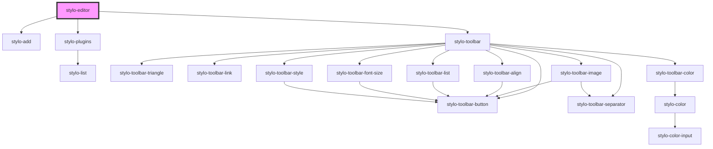

# stylo-editor

<!-- Auto Generated Below -->

## Properties

| Property       | Attribute | Description                                                                                                                                                           | Type          | Default     |
| -------------- | --------- | --------------------------------------------------------------------------------------------------------------------------------------------------------------------- | ------------- | ----------- |
| `config`       | --        | Optional editor configuration. - Language - Plugin, if provided, replaces the default plugin config - Toolbar, if provided, is merged with the default toolbar config | `StyloConfig` | `undefined` |
| `containerRef` | --        | The container (e.g. an article, a div, etc.) that contains the content, the paragraphs. Must have the attribute `contenteditable` set to `true`.                      | `HTMLElement` | `undefined` |

## Dependencies

### Depends on

- [stylo-add](../plugins/add)
- [stylo-plugins](../plugins/plugins)
- [stylo-toolbar](../toolbar/toolbar)

### Graph

----------------------------------------------

*Built with [StencilJS](https://stenciljs.com/)*
