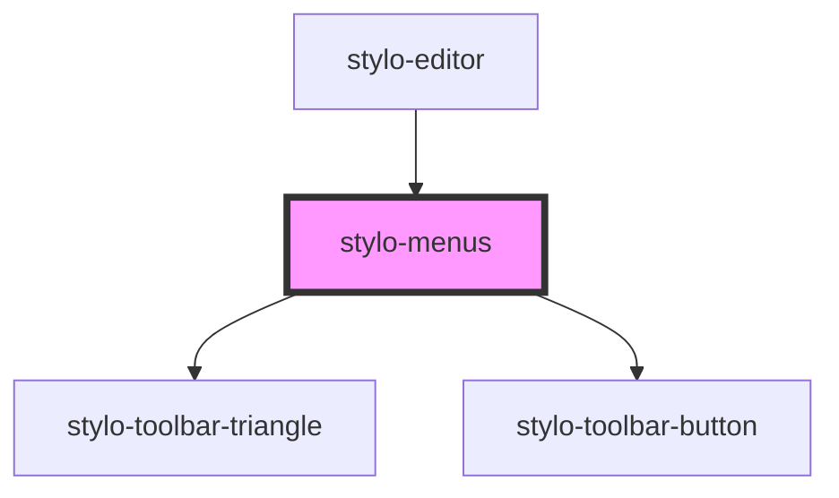

# stylo-menus

<!-- Auto Generated Below -->

## Events

| Event        | Description                                                                                               | Type                                |
| ------------ | --------------------------------------------------------------------------------------------------------- | ----------------------------------- |
| `menuAction` | An event triggered when user select one of the custom actions of the menus provided in your configuration | `CustomEvent<StyloMenuActionEvent>` |

## Dependencies

### Used by

- [stylo-editor](../editor)

### Depends on

- [stylo-toolbar-triangle](../toolbar/triangle)
- [stylo-toolbar-button](../toolbar/button)

### Graph

---

_Built with [StencilJS](https://stenciljs.com/)_
