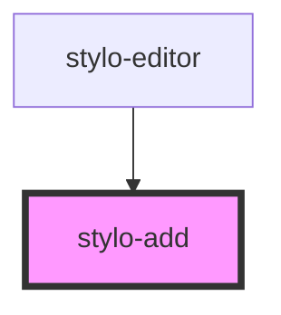

# stylo-add

<!-- Auto Generated Below -->

## Events

| Event             | Description                                                                                                                                                                                                                                                                            | Type                       |
| ----------------- | -------------------------------------------------------------------------------------------------------------------------------------------------------------------------------------------------------------------------------------------------------------------------------------- | -------------------------- |
| `hidePlugins`     | If user types anything else than a "/" in an empty paragraph, hide the plugins.                                                                                                                                                                                                        | `CustomEvent<void>`        |
| `listPlugins`     | An event emitted when user click on the shadowed button. - If selected paragraph is empty, emitted straight away - If not empty, first a new paragraph is created and then event is emitted Event is catched in `<style-plugins/>` and used to trigger the display of list of plugins. | `CustomEvent<HTMLElement>` |
| `selectParagraph` | Emits the paragraph that is selected either with mouse, touch or keyboard actions                                                                                                                                                                                                      | `CustomEvent<HTMLElement>` |

## CSS Custom Properties

| Name                                 | Description                                              |
| ------------------------------------ | -------------------------------------------------------- |
| `--stylo-add-background-color`       | The background-color of the button @default 0.2rem       |
| `--stylo-add-background-color-hover` | The hover background-color of the button @default 0.2rem |
| `--stylo-add-border`                 | The border of the button @default none                   |
| `--stylo-add-border-radius`          | The border-radius of the button @default 50%             |
| `--stylo-add-color`                  | The color of the button @default 0.2rem                  |
| `--stylo-add-color-hover`            | The hover color of the button @default 0.2rem            |
| `--stylo-add-size`                   | The size of the button @default 1.4rem                   |

## Dependencies

### Used by

- [stylo-editor](../../editor)

### Graph

---

_Built with [StencilJS](https://stenciljs.com/)_
