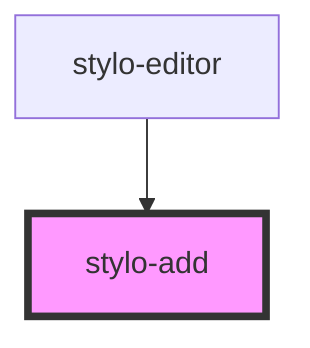

# stylo-add

<!-- Auto Generated Below -->

## Events

| Event         | Description                                                                                                                                                                                                                                                                            | Type                       |
| ------------- | -------------------------------------------------------------------------------------------------------------------------------------------------------------------------------------------------------------------------------------------------------------------------------------- | -------------------------- |
| `hidePlugins` | If user types anything else than a "/" in an empty paragraph, hide the plugins.                                                                                                                                                                                                        | `CustomEvent<void>`        |
| `listPlugins` | An event emitted when user click on the shadowed button. - If selected paragraph is empty, emitted straight away - If not empty, first a new paragraph is created and then event is emitted Event is catched in `<style-plugins/>` and used to trigger the display of list of plugins. | `CustomEvent<HTMLElement>` |

## Dependencies

### Used by

- [stylo-editor](../../editor)

### Graph

---

_Built with [StencilJS](https://stenciljs.com/)_
