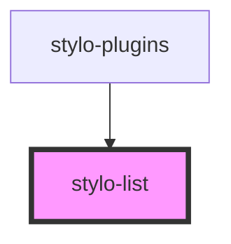

# stylo-list

<!-- Auto Generated Below -->

## Events

| Event           | Description                                            | Type                       |
| --------------- | ------------------------------------------------------ | -------------------------- |
| `applyPlugin`   | Emit which plugin the user want to apply.              | `CustomEvent<StyloPlugin>` |
| `cancelPlugins` | Emit when user actually do not want to apply a plugin. | `CustomEvent<void>`        |

## Methods

### `focusFirstButton() => Promise<void>`

#### Returns

Type: `Promise<void>`

## Dependencies

### Used by

- [stylo-plugins](../plugins)

### Graph

---

_Built with [StencilJS](https://stenciljs.com/)_
