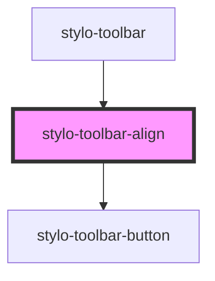

# stylo-toolbar-align

<!-- Auto Generated Below -->

## Properties

| Property       | Attribute | Description | Type                                                             | Default     |
| -------------- | --------- | ----------- | ---------------------------------------------------------------- | ----------- |
| `align`        | `align`   |             | `ToolbarAlign.CENTER \| ToolbarAlign.LEFT \| ToolbarAlign.RIGHT` | `undefined` |
| `anchorEvent`  | --        |             | `MouseEvent \| TouchEvent`                                       | `undefined` |
| `containerRef` | --        |             | `HTMLElement`                                                    | `undefined` |

## Events

| Event           | Description | Type               |
| --------------- | ----------- | ------------------ |
| `alignModified` |             | `CustomEvent<any>` |

## Dependencies

### Used by

 - [stylo-toolbar](../../toolbar)

### Depends on

- [stylo-toolbar-button](../../button)

### Graph

----------------------------------------------

*Built with [StencilJS](https://stenciljs.com/)*
