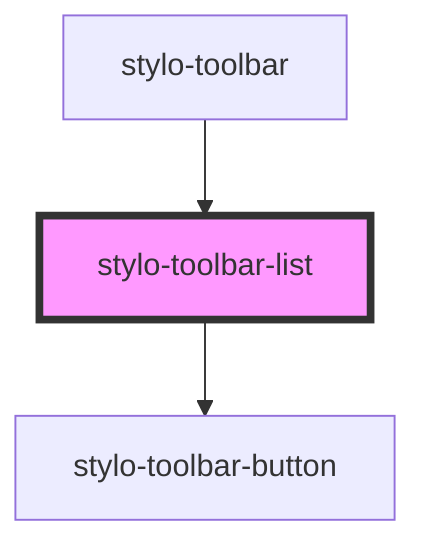

# stylo-toolbar-list

<!-- Auto Generated Below -->

## Properties

| Property        | Attribute        | Description | Type                                           | Default     |
| --------------- | ---------------- | ----------- | ---------------------------------------------- | ----------- |
| `disabledTitle` | `disabled-title` |             | `boolean`                                      | `false`     |
| `list`          | `list`           |             | `ToolbarList.ORDERED \| ToolbarList.UNORDERED` | `undefined` |

## Events

| Event         | Description | Type                             |
| ------------- | ----------- | -------------------------------- |
| `execCommand` |             | `CustomEvent<ExecCommandAction>` |

## Dependencies

### Used by

- [stylo-toolbar](../../toolbar)

### Depends on

- [stylo-toolbar-button](../../button)

### Graph

---

_Built with [StencilJS](https://stenciljs.com/)_
