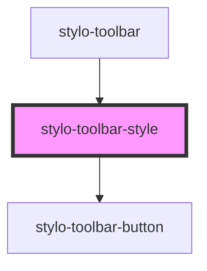

# stylo-toolbar-style

<!-- Auto Generated Below -->

## Properties

| Property        | Attribute        | Description | Type      | Default     |
| --------------- | ---------------- | ----------- | --------- | ----------- |
| `bold`          | `bold`           |             | `boolean` | `undefined` |
| `disabledTitle` | `disabled-title` |             | `boolean` | `false`     |
| `italic`        | `italic`         |             | `boolean` | `undefined` |
| `strikethrough` | `strikethrough`  |             | `boolean` | `undefined` |
| `underline`     | `underline`      |             | `boolean` | `undefined` |

## Events

| Event         | Description | Type                             |
| ------------- | ----------- | -------------------------------- |
| `execCommand` |             | `CustomEvent<ExecCommandAction>` |

## Dependencies

### Used by

 - [stylo-toolbar](../../toolbar)

### Depends on

- [stylo-toolbar-button](../../button)

### Graph

----------------------------------------------

*Built with [StencilJS](https://stenciljs.com/)*
