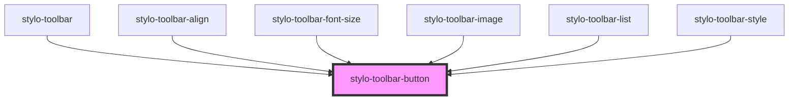

# stylo-toolbar-button

<!-- Auto Generated Below -->

## Properties

| Property        | Attribute        | Description | Type      | Default     |
| --------------- | ---------------- | ----------- | --------- | ----------- |
| `cssClass`      | `css-class`      |             | `string`  | `undefined` |
| `disableAction` | `disable-action` |             | `boolean` | `false`     |

## Events

| Event    | Description | Type                   |
| -------- | ----------- | ---------------------- |
| `action` |             | `CustomEvent<UIEvent>` |

## Dependencies

### Used by

 - [stylo-toolbar](../toolbar)
 - [stylo-toolbar-align](../actions/align)
 - [stylo-toolbar-font-size](../actions/font-size)
 - [stylo-toolbar-image](../actions/image)
 - [stylo-toolbar-list](../actions/list)
 - [stylo-toolbar-style](../actions/style)

### Graph

----------------------------------------------

*Built with [StencilJS](https://stenciljs.com/)*
