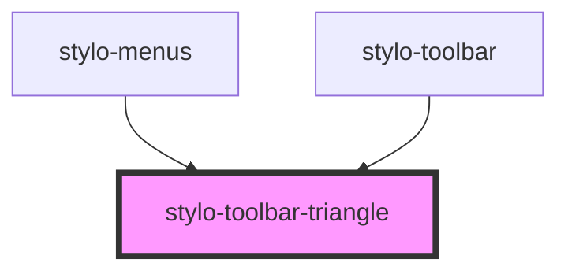

# stylo-toolbar-triangle

<!-- Auto Generated Below -->

## Properties

| Property | Attribute | Description | Type      | Default     |
| -------- | --------- | ----------- | --------- | ----------- |
| `mobile` | `mobile`  |             | `boolean` | `undefined` |

## Dependencies

### Used by

- [stylo-menus](../../menu)
- [stylo-toolbar](../toolbar)

### Graph

---

_Built with [StencilJS](https://stenciljs.com/)_
