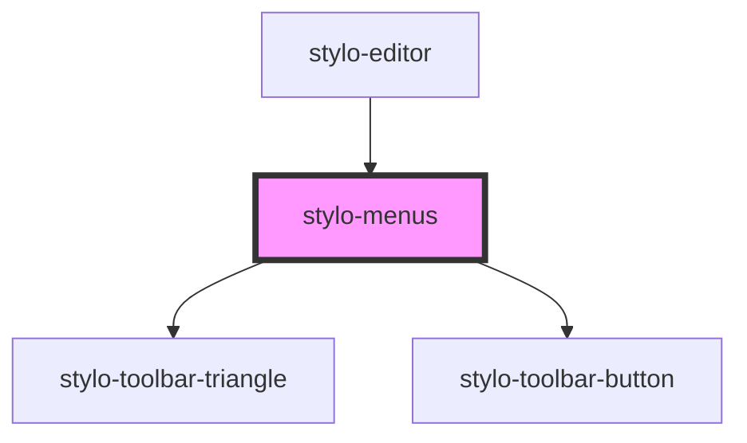

# stylo-menus

<!-- Auto Generated Below -->

## Dependencies

### Used by

- [stylo-editor](../../editor)

### Depends on

- [stylo-toolbar-triangle](../triangle)
- [stylo-toolbar-button](../button)

### Graph

---

_Built with [StencilJS](https://stenciljs.com/)_
