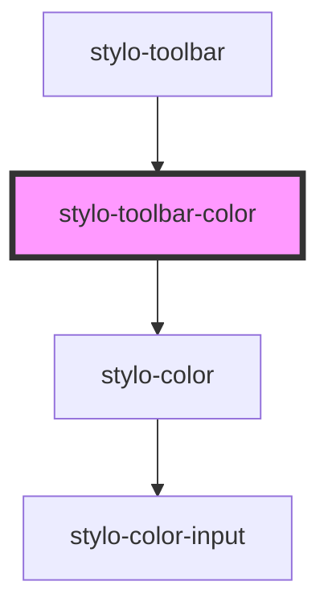

# stylo-toolbar-color

<!-- Auto Generated Below -->

## Properties

| Property       | Attribute | Description | Type                            | Default     |
| -------------- | --------- | ----------- | ------------------------------- | ----------- |
| `action`       | `action`  |             | `"background-color" \| "color"` | `undefined` |
| `containerRef` | --        |             | `HTMLElement`                   | `undefined` |

## Events

| Event         | Description | Type                             |
| ------------- | ----------- | -------------------------------- |
| `execCommand` |             | `CustomEvent<ExecCommandAction>` |

## Dependencies

### Used by

- [stylo-toolbar](../../toolbar)

### Depends on

- [stylo-color](../../../../color/color)

### Graph

---

_Built with [StencilJS](https://stenciljs.com/)_
