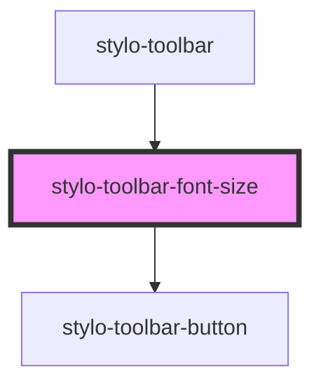

# stylo-toolbar-font-size

<!-- Auto Generated Below -->

## Properties

| Property   | Attribute   | Description | Type                                                                                                                                                                                      | Default     |
| ---------- | ----------- | ----------- | ----------------------------------------------------------------------------------------------------------------------------------------------------------------------------------------- | ----------- |
| `fontSize` | `font-size` |             | `ToolbarFontSize.LARGE \| ToolbarFontSize.MEDIUM \| ToolbarFontSize.SMALL \| ToolbarFontSize.XXX_LARGE \| ToolbarFontSize.XX_LARGE \| ToolbarFontSize.X_LARGE \| ToolbarFontSize.X_SMALL` | `undefined` |

## Events

| Event         | Description | Type                             |
| ------------- | ----------- | -------------------------------- |
| `execCommand` |             | `CustomEvent<ExecCommandAction>` |

## Dependencies

### Used by

- [stylo-toolbar](../../toolbar)

### Depends on

- [stylo-toolbar-button](../../../button)

### Graph

---

_Built with [StencilJS](https://stenciljs.com/)_
