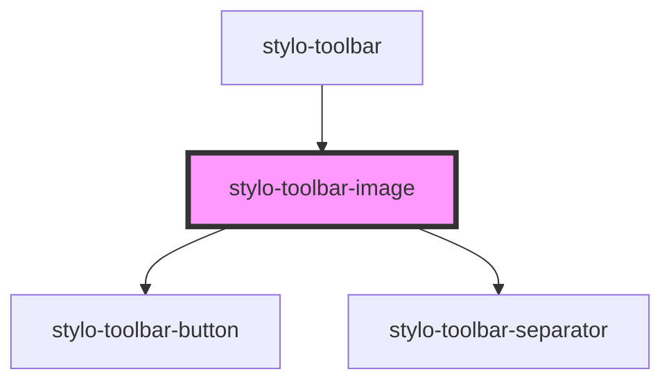

# stylo-toolbar-image

<!-- Auto Generated Below -->

## Properties

| Property       | Attribute | Description | Type                        | Default     |
| -------------- | --------- | ----------- | --------------------------- | ----------- |
| `anchorEvent`  | --        |             | `MouseEvent \| TouchEvent`  | `undefined` |
| `containerRef` | --        |             | `HTMLElement`               | `undefined` |
| `imgDidChange` | --        |             | `EventEmitter<HTMLElement>` | `undefined` |

## Events

| Event         | Description | Type                |
| ------------- | ----------- | ------------------- |
| `imgModified` |             | `CustomEvent<void>` |

## Dependencies

### Used by

- [stylo-toolbar](../../toolbar)

### Depends on

- [stylo-toolbar-button](../../../button)
- [stylo-toolbar-separator](../../separator)

### Graph

---

_Built with [StencilJS](https://stenciljs.com/)_
