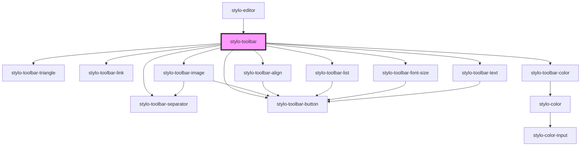

# stylo-toolbar

<!-- Auto Generated Below -->

## Properties

| Property       | Attribute | Description                                                                                                         | Type                                                                                                                                                                                                                                 | Default     |
| -------------- | --------- | ------------------------------------------------------------------------------------------------------------------- | ------------------------------------------------------------------------------------------------------------------------------------------------------------------------------------------------------------------------------------ | ----------- |
| `config`       | --        | If used in a standalone mode, the configuration can also be set. It will be applied over the default configuration. | `{ palette?: StyloPalette[]; command?: "native" \| "custom"; style?: { img?: { anchor: string; propertyWidth: string; propertyCssFloat: string; }; list: boolean; align: boolean; fontSize: boolean; backgroundColor: boolean; }; }` | `undefined` |
| `containerRef` | --        | To attach the inline editor event listeners to a specific container instead of the document                         | `HTMLElement`                                                                                                                                                                                                                        | `undefined` |

## Events

| Event              | Description                                                                                                               | Type                       |
| ------------------ | ------------------------------------------------------------------------------------------------------------------------- | -------------------------- |
| `imgDidChange`     | Triggered when an image is manipulated. Note: the event won't provide directly the image but rather its container element | `CustomEvent<HTMLElement>` |
| `linkCreated`      | Triggered when a link is created by the user. The event detail is the container                                           | `CustomEvent<HTMLElement>` |
| `styleDidChange`   | Triggered when the style is modified (bold, italic, color, alignment, etc.). The event detail is the container            | `CustomEvent<HTMLElement>` |
| `toolbarActivated` |                                                                                                                           | `CustomEvent<boolean>`     |

## Dependencies

### Used by

- [stylo-editor](../../../editor)

### Depends on

- [stylo-toolbar-triangle](../../triangle)
- [stylo-toolbar-link](../actions/link)
- [stylo-toolbar-color](../actions/color)
- [stylo-toolbar-image](../actions/image)
- [stylo-toolbar-align](../actions/align)
- [stylo-toolbar-list](../actions/list)
- [stylo-toolbar-font-size](../actions/font-size)
- [stylo-toolbar-separator](../separator)
- [stylo-toolbar-button](../../button)
- [stylo-toolbar-text](../actions/text)

### Graph

---

_Built with [StencilJS](https://stenciljs.com/)_
