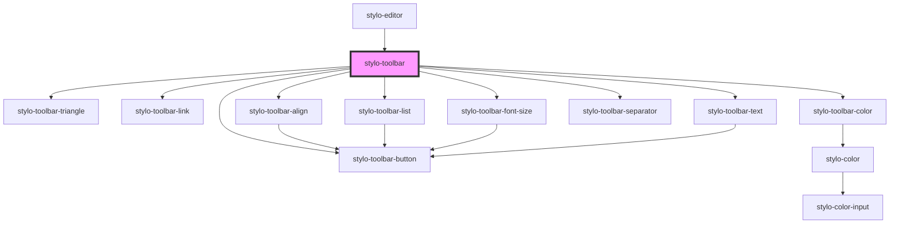

# stylo-toolbar

<!-- Auto Generated Below -->

## Properties

| Property       | Attribute | Description                                                                                                         | Type                                                                                                                                                     | Default     |
| -------------- | --------- | ------------------------------------------------------------------------------------------------------------------- | -------------------------------------------------------------------------------------------------------------------------------------------------------- | ----------- |
| `config`       | --        | If used in a standalone mode, the configuration can also be set. It will be applied over the default configuration. | `{ palette?: StyloPalette[]; command?: "custom" \| "native"; style?: { list: boolean; align: boolean; fontSize: boolean; backgroundColor: boolean; }; }` | `undefined` |
| `containerRef` | --        | To attach the inline editor event listeners to a specific container instead of the document                         | `HTMLElement`                                                                                                                                            | `undefined` |

## Events

| Event              | Description                                                                                                    | Type                       |
| ------------------ | -------------------------------------------------------------------------------------------------------------- | -------------------------- |
| `linkCreated`      | Triggered when a link is created by the user. The event detail is the container                                | `CustomEvent<HTMLElement>` |
| `styleDidChange`   | Triggered when the style is modified (bold, italic, color, alignment, etc.). The event detail is the container | `CustomEvent<HTMLElement>` |
| `toolbarActivated` |                                                                                                                | `CustomEvent<boolean>`     |

## CSS Custom Properties

| Name                                      | Description                                                                        |
| ----------------------------------------- | ---------------------------------------------------------------------------------- |
| `--stylo-toolbar-button-color`            | The buttons color @default black                                                   |
| `--stylo-toolbar-button-color-active`     | The color of the buttons when active @default --highlight (see \_variables.scss)   |
| `--stylo-toolbar-button-color-disabled`   | The color of the buttons when disabled @default --light (see \_variables.scss)     |
| `--stylo-toolbar-button-display-disabled` | Per default the disable elements on title elements are not displayed @default none |
| `--stylo-toolbar-button-font-family`      | The buttons font family @default inherit                                           |
| `--stylo-toolbar-button-font-size`        | The buttons font size @default 1.4rem                                              |
| `--stylo-toolbar-button-zindex`           | The z-index of the action buttons @default 2                                       |
| `--stylo-toolbar-link-color`              | The color property of the link input @default black                                |
| `--stylo-toolbar-link-placeholder-color`  | The color of the place holder of the link input @default black                     |
| `--stylo-toolbar-link-zindex`             | The z-index property of the link input @default 2                                  |
| `--stylo-toolbar-min-height`              | The height of the toolbar @default 44px                                            |
| `--stylo-toolbar-min-width`               | The width of the toolbar @default 280px                                            |
| `--stylo-toolbar-separator-background`    | The background of the separator @default #f4f5f8                                   |
| `--stylo-toolbar-triangle-box-shadow`     | The box-shadow of the triangle @default 0 0 8px 0 rgba(0, 0, 0, 0.1)               |
| `--stylo-toolbar-triangle-center`         | The center position of the triangle (overwrite --stylo-toolbar-triangle-start)     |
| `--stylo-toolbar-triangle-start`          | The left position of the triangle @default 8px                                     |
| `--stylo-toolbar-zindex`                  | The z-Index of the toolbar @default 2                                              |

## Dependencies

### Used by

- [stylo-editor](../../../editor)

### Depends on

- [stylo-toolbar-triangle](../../triangle)
- [stylo-toolbar-link](../actions/link)
- [stylo-toolbar-color](../actions/color)
- [stylo-toolbar-align](../actions/align)
- [stylo-toolbar-list](../actions/list)
- [stylo-toolbar-font-size](../actions/font-size)
- [stylo-toolbar-separator](../separator)
- [stylo-toolbar-button](../../button)
- [stylo-toolbar-text](../actions/text)

### Graph

---

_Built with [StencilJS](https://stenciljs.com/)_
